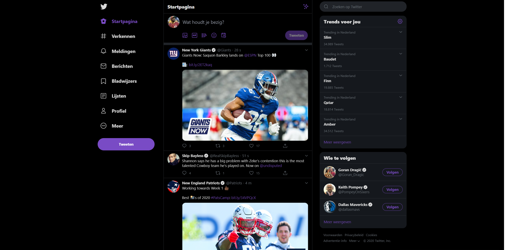
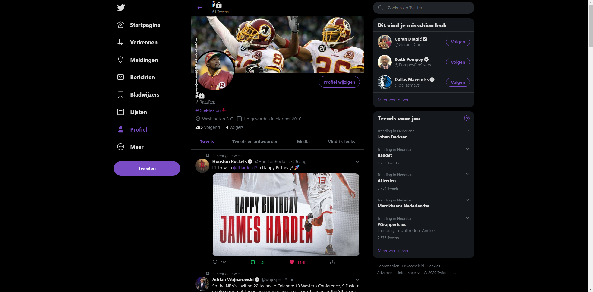
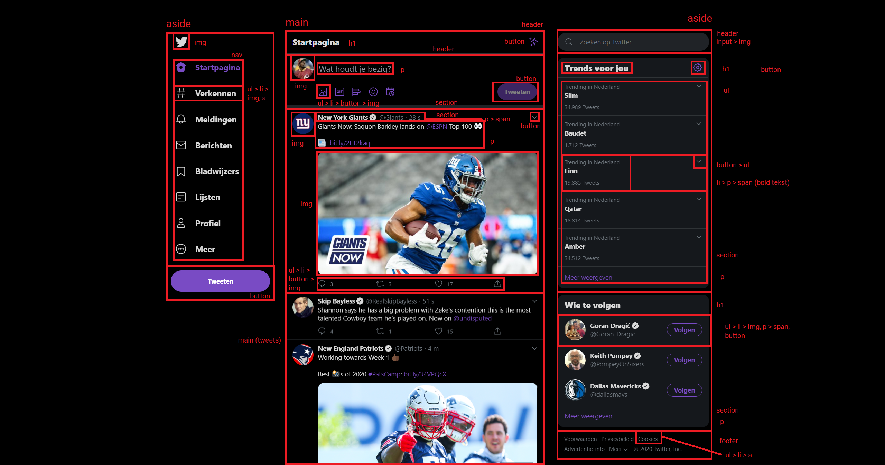
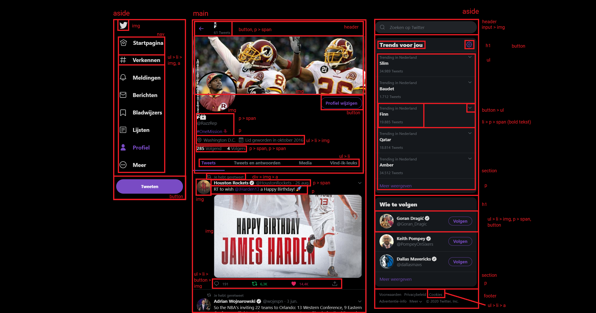

# Procesverslag
**Auteur:** Milan Steman

**Studentnummer:** 500800819

**Klas:** 207(b)

**Laatst aangepast:** 02/09/2020

## Bronnenlijst
1. [twitter.com](https://twitter.com/home)
2. ...
3. ...

## Intake (week 1)

**Je startniveau:** rood

**Je focus:** Het liefst beide - responsive en surface.

**Je opdracht:** twitter.com *(zou wel graag wat kleine aanpassingen maken qua stijling + als extra wil ik dat je zelf tweets kan maken en opslaan. Een soort van 'CRUD' met localstorage)*

**Screenshot(s):** 

Twitter Home

Twitter Profile

**Breakdown-schets(en):**

Twitter Home

Twitter Profile

## Eindgesprek (week 7/8)

-dit ging goed & dit was lastig-

**Screenshot(s):**

-screenshot(s) van je eindresultaat-

## Voortgang 3 (week 6)

-same as voortgang 1-

## Voortgang 2 (week 5)

-same as voortgang 1-

## Voortgang 1 (week 3)

### Stand van zaken

-dit ging goed & dit was lastig-

**Screenshot(s):**

-screenshot(s) van hoe ver je bent-
                                                                                    
### Agenda voor meeting

-samen met je groepje opstellen-

### Verslag van meeting

-na afloop snel uitkomsten vastleggen-

Markdown cheat cheet: [Hulp bij het schrijven van Markdown](https://github.com/adam-p/markdown-here/wiki/Markdown-Cheatsheet). Nb. de standaardstructuur en de spartaanse opmaak zijn helemaal prima. Het gaat om de inhoud van je procesverslag. Besteedt de tijd voor pracht en praal aan je website.