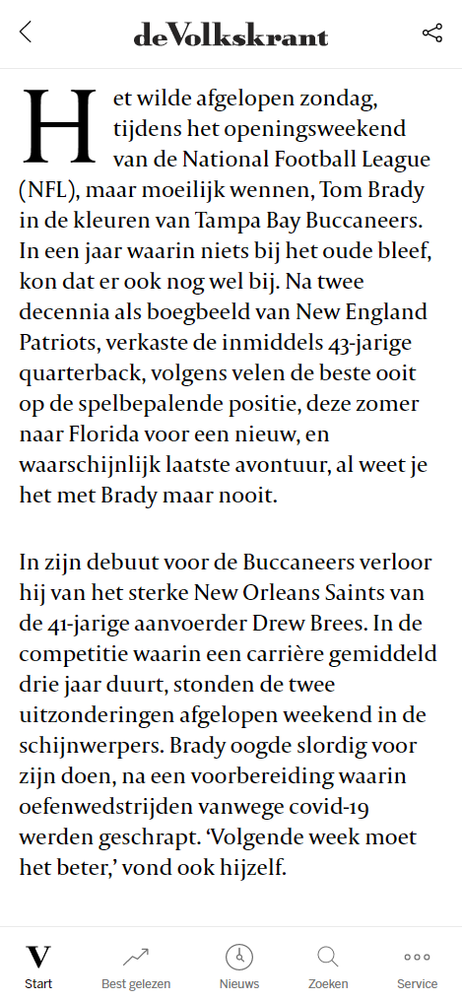

# Procesverslag
**Auteur:** Milan Steman

**Studentnummer:** 500800819

**Klas:** 207(b)

**Laatst aangepast:** 19/10/2020

**Codepen:** [https://codepen.io/MilanSteman](https://codepen.io/MilanSteman)
## Bronnenlijst
1. https://www.volkskrant.nl/
2. https://developer.mozilla.org/en-US/docs/Web/CSS/CSS_Lists_and_Counters/Using_CSS_counters
3. https://codepen.io/pimpiet/pen/bRqegQ
4. https://css-tricks.com/snippets/css/complete-guide-grid/
5. https://developer.mozilla.org/en-US/docs/Web/CSS/Using_CSS_custom_properties

## Intake (week 1)

**Je startniveau:** Rood

**Je focus:** Responsiveness staat bij mij op 1.

**Je opdracht:** De volkskrant home- en nieuwspagina namaken. 

**Screenshot(s):** 

Volkskrant Home

Volkskrant Nieuwsartikel

**Breakdown-schets(en):**

Volkskrant Home (Breakdown)

Volkskrant Nieuwsartikel (Breakdown)

## Voortgang 1 (week 3)

### Stand van zaken
Ik heb geprobeerd om alvast de navigatie en het eerste scherm na te maken. Alle fonts zijn al goed geimporteerd. Ik ben blij met het resultaat tot nu toe.

**Lastige Dingen:**

• Shadow op image krijgen bij de tekst die erop kwam.

• Navbar op mobiel groter krijgen dan 100% was een beetje tricky.

• SVGtjes in de Navbar wilde niet.

• Navbar fixed maken nadat je er voorbij gaat.

• De header teaser bovenin goed 'alignen'.

• Nog niet begonnen met een tweede pagina en heb nog niet volledige HTML.

**Dit ging goed:**

• Consistente margins en paddings. 

• Site lijkt best erg op de Volkskrant al.

• Goed begonnen met CSS variabelen.

• Lijst met artikelen is goed gelukt met flexbox.

**Screenshot(s):**

                                                                                    
### Agenda voor meeting

Even praten over flexbox, hoe je een SVG kan overnemen van een website, websites van anderen ontdekken en elkaar eventueel helpen
met vragen.

### Verslag van meeting

Zelf loop ik vandaag al wat voor op de rest. Dit vind ik wel fijn. De agenda even doorgenomen
en voor het volgende voortgangsgesprek zou ik het liefst op mobile de twee pagina's volledig af willen hebben.

## Voortgang 2 (week 5)

### Stand van zaken
Voor de tweede meeting heb ik vooral gewerkt aan het toevoegen van content aan de homepage. Aan de tweede pagina ben ik nog niet begonnen, maar de homepage is nu voor ongeveer 50-60% af.

**Lastige Dingen:**

• Smooth scroll wil niet werken als ik een bij het scrollen een functie oproep.

• Gebruik nu veel classes en CSS is erg messy aan het worden.

• Nog niet begonnen met een tweede pagina en heb nog niet volledige HTML.

• 'Meer' button lukt niet met centreren zonder dat ik ze een width geef.

**Dit ging goed:**

• SVG'tjes kopieren van de Volkskrant is goed gelukt 

• Navbar micro-interactie is goed gelukt en ziet er nice uit.

• Website is zo goed als responsive op alle telefoons.

• Veel diverse content (zoals cards en lijstjes) staan al op de website.

• Headers per section zijn goed gelukt.

**Screenshot(s):**

                                                                            
### Agenda voor meeting

Kijken hoe ik de pagina kan laten smooth scrollen want nu gaat hij maar 1px elke keer omhoog. Vragen hoeveel content ik nodig heb op
de site, want de volkskrant heeft een heleboel content

### Verslag van meeting

Ben nog steeds goed opweg met mijn site, jammer dat de smooth scrolling niet helemaal goed werkt. Moet er wel voor zorgen dat ik de tweede
pagina van mijn site wel alvast ga opzetten. Dus dat wil ik voor de volgende week af hebben.

## Voortgang 3 (week 6)

### Stand van zaken
Voor de meeting van week 6 heb ik een begin gemaakt aan de artikel pagina. Deze is nog niet helemaal af. Verder is zowat alle content van de homepage af. Ik heb de artikel pagina niet helemaal kunnen afkrijgen. Dit is een beetje jammer, want ik heb mijn doel niet helemaal gehaald.
Verder moet ik nog beide pagina's responsive maken, wat veel werk is.

**Lastige Dingen:**

• Smooth scroll werkt maar met 'messy' Javascript - alles wordt constant herhaald en kan ge-optimaliseerder.

• Artikel bevat nog niet alle content.

• Nog niet begonnen met een tweede pagina en heb nog niet volledige HTML.

• Responsive laag moet ik nog mee beginnen.

• Heb een heleboel plaatje die ik niet gebruk.

**Dit ging goed:**

• Code cleanup gedaan, alle onnodige classes weggehaald en CSS zo geschreven dat artikelen 'gerecycled' kunnen worden. 

• Begonnen aan tweede pagina die er goed uit ziet

• Content op homepage is nu af.

• Veel diverse content (zoals cards en lijstjes) staan al op de website.

**Screenshot(s):**

       

                                                                       
### Agenda voor meeting

Ben al best goed opweg, misschien wat vragen stellen over responsiveness en een beetje Javascript optimalisatie. Niet veel aan toe te voegen.

### Verslag van meeting

Site ziet er prima uit, moet wel natuurlijk nog een responsive laag toevoegen en kan ook nog wat interacties erbij doen.

## Eindgesprek (week 7/8)

### Stand van zaken
Super blij met het eindresultaat van mijn site. De website is volledig responsive op minimaal een iPhone SE tot een 1440p scherm. Dus ook voor iPad/Tablet formaat en kleinere schermen.
De responsiveness is gemaakt door een grid te gebruiken die van 2 kolom naar 3 kolom springt en uiteindelijk naar 4 kolom.

Meerdere interacties toegevoegd bij het artikel zoals:

• Share-button

• Button die je omhoog brengt na het lezen van 35% van een artikel

• Indicatie van hoe ver je bent door het artikel

**Screenshot(s):**

### Home

Eindresultaat Mobile

Eindresultaat Desktop (groot)

Eindresultaat Desktop (klein)

       

Eindresultaat Tablet

### Artikel

Eindresultaat Mobile

                                                                       

Eindresultaat Desktop (groot)

Eindresultaat Desktop (klein)

       

Eindresultaat Tablet

   

Markdown cheat cheet: [Hulp bij het schrijven van Markdown](https://github.com/adam-p/markdown-here/wiki/Markdown-Cheatsheet). Nb. de standaardstructuur en de spartaanse opmaak zijn helemaal prima. Het gaat om de inhoud van je procesverslag. Besteedt de tijd voor pracht en praal aan je website.